# Collision Design Doc

Benjamin Zhao - 22/11/2018

## Motivation

The purpose of this document is to define the challenge, design and decision that goes towards `deterministically resolving concurrent collisions` among units in Project Castle. The document illustrates the proposed solution and how its flexibility handles the necessicites of the game. 

## Pre-requisites

To give a sense of how collision should be handled in Project Castle, this section is an overview of the mechanics that go behind simulatenous turn-based combat.

### Action

An action denotes a set of `frames` (defined in the later section) to be executed over a defined period of time during a turn. Each action consumes a number of `Action Points` (AP) from the unit executing the action. All frames which are part of an action are considered as the action's type (that is, all frames of an action have the same priority). As a limitation of Project Castle, no action should queue a list of frames which spans multiple turns.

The following type of actions exist in Project Castle:
```C#
public enum ActionType {
	HighPriority,
	Movement,
	Effect,
	Attack,
	LowPriority
}
```
> Note this classification does not strictly define what an action may do. For example, an attack action can also move the unit, but all frames belonging to the action are still considered attack-type. 

### Timeline Phases

The challenge behind simulatenous turn-based combat is executing concurrent moves in a sequential manner. In this sense, the limitation of Project Castle relies on a non-ordered basis of execution. That is, regardless of the order in which frames are executed in, the result is deterministic.

Although timing of execution should not be important, the limitations of order of execution poses an interesting question. When a unit moves while another attacks, does the moving unit avoid or take the attack? In this sense, timing of execution is important. The current solution breaks down moves into priorities to avoid conflicts. Each priority is executed at a specific phase within the frame. Within each phase of the frame, order of execution is not important.

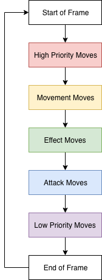

Referring back to the case study, if unit `A` moves and unit `B` attacks, A's action is queued into the movement action. B's action is queued into the attack action. Therefore A's action is executed first, thus avoiding B's attack.

> Note the indicated names of phases are arbitrary. We can set the types of phases however we like and reorder them as we see fit.

## Unit Displacement Concept

In ProjectCastle, we define unit movement to be classified into two categories: `AbsoluteDisplacement` and `RelativeDisplacement`. 

```C#
public enum UnitDisplacementType {
	ABSOLUTE,
	RELATIVE
}
```

The distinction between the two categories is how unit movement will be handled, and the resolution of conflicts. Both of these classes inherit from the abstract class `UnitDisplacement` which define the basis of the displacement classes.

```C#
public abstract class UnitDisplacement {
	public Unit unit;
	public UnitDisplacementType type;

	public virtual Vector2 GetStartCoordinate() ...
	public virtual Vector2 GetTargetCoordinate() ...
	...
}
```

### AbsoluteDisplacement

```
Moves the unit to a static location on the board.
```

Consider AbsoluteDisplacement to be synonymous to a blink/teleport effect. A unit targets a tile on the existing game board and teleports to directed location when executed. If conflicts occur, the teleporting unit should return to it's original location. Buildings and units in-between the teleporting unit and its target location are not obstructions to the execution of the action.

```C#
public class AbsoluteDisplacement : UnitDisplacement {
	Vector2 coordinate;

	public override Vector2 GetTargetCoordinate() {
		return coordinate;
	}
	...
}
```

#### Case 1: Basic Teleport Resolution

Consider a unit `A` starting at (0,2) and targeting position (2,1). We notice there are no conflicts on the board.

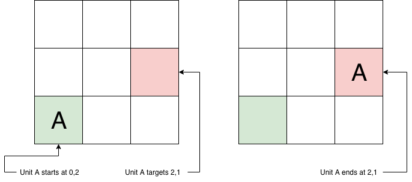

#### Case 2: Conflict Teleport Resolution

Consider a unit `A` starting at (0,2) targeting position (2,1), and unit `B` waiting at position (2,1). We notice there is a conflict on the board and we need to retract `A` back to its original location.

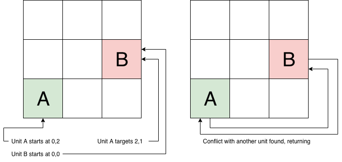

### RelativeDisplacement

```
Moves the unit relative to their current location.
```

Consider RelativeDisplacement to be synonymous to a dash effect. A unit targets a tile or provides a relative vector denoting how many squares in the vertical and horizontal direction they want to move (to reach a location). If a conflict occurs, the unit is moved to the last non-conflicting location on the path. Buildings and units in-between the moving unit and its path are obstructions to the execution of the action. The unit is also moved to the last non-conflicting location on the path.

```C#
public class RelativeDisplacement : UnitDisplacement {
	Vector2 displacement;

	public override Vector2 GetTargetCoordinate() {
		return GetStartCoordinate() + displacement;
	}
	...
}
```
#### Diagonal Displacements

Inorder to draw a path for a displacement in a diagonal direction, we use a stepping mechanic which determines which tiles belong to the path. The stepping mechanic takes the displacement, finds the ratio between (x,y) and turns the larger axis into a unit step, and the smaller axis to a sub-one decimal step.

```C#
public Vector2 GetUnitStep() {
	if(displacement.x >= displacement.y) {
		return displacement / displacement.x;
	} else {
		return displacement / displacement.y;
	}
}
```

Take the following (2,-1) displacement vector for example for a unit starting at (0,2). Thus the unit step for the displacement vector is (1,-0.5). We continually add all tiles which exist on our path, moving (1,-0.5) step at a time. Note that if our coordinate results in decimal places, we round to the nearest ones. Thus the resultant path would look like this:

```
(0,2)
(1, 1.5) --> (1, 2)
(2, 1)
```

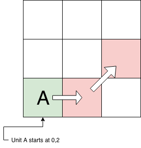

#### Case 1: Basic Dash Resolution

Consider a unit `A` starting at (0,2) and dashing to position (2,2) . We notice there are no conflicts along the path.

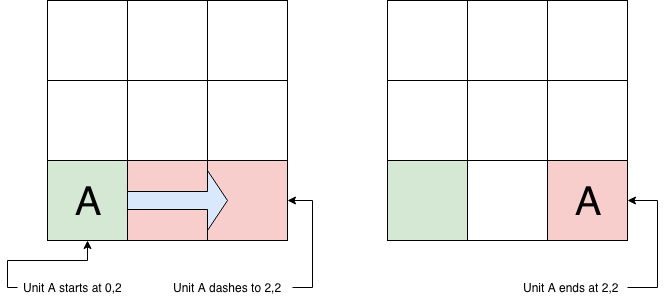

#### Case 2: Conflict Dash Resolution

Consider a unit `A` starting at (0,2) dashing to position (2,2) with a displacement vector (2,0), and unit `B` waiting at position (2,2). We notice there is a conflict along the path, but the last non-conflicting location is (2,1) so move `A` here.

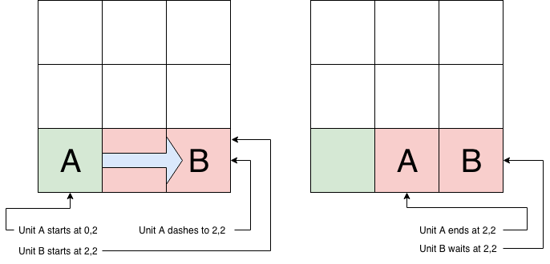

### Displacement Aggregation

In ProjectCastle, a possible unit action involves push/shoving other units. When a unit is being shoved in multiple directions, the displacement of the unit should be considered from all sources. On the otherhand, a unit who is being shoved while teleporting is susceptable to conflict of sequential ordering. That is, should the unit be displaced after teleporting or before (in which case the units final location does not change). The proposed solution is that blinks will have priority over shoves. Thus summing any AbsoluteDisplacement in an equation result in the AbsoluteDisplacement.

>  The solution is based off League of Legends' blinking skill priority.

`
Summing any two or more Absolute Displacements does not result in valid behaviour. The limitation of the ProjectCastle states that teleporting more than once in a single frame does not conceptually make sense. 
`

```C#
//AbsoluteDisplacement have priority over RelativeDisplacement(ie Blink overrides Dash)
public static AbsoluteDisplacement operator+ (AbsoluteDisplacement a, RelativeDisplacement b) {
	if(a.unit != b.unit) {
		throw new Exception("Units are not the same");
	}

	return a;
}

public static AbsoluteDisplacement operator+ (RelativeDisplacement a, AbsoluteDisplacement b) {
	if(a.unit != b.unit) {
		throw new Exception("Units are not the same");
	}

	return b;
}

public static RelativeDisplacement operator+ (RelativeDisplacement a, RelativeDisplacement b) {
	if(a.unit != b.unit) {
		throw new Exception("Units are not the same");
	}

	return new RelativeDisplacement(a.unit, a.displacement + b.displacement);
}
```

## Conflict Resolution Theory

The proposed solution towards resolving unit collision involves simulating the result of the frame, and then continually resolving conflicts until no more conflicts exist. The idea revolves around map-reducing a set of nodes of a graph and relaxing each node until the graph settles.

> We can prove that the graph will always settle, based on the fact that at worst case scenario, all units return to their original position!

Consider a directed graph where each node represents a tile. The edges of a graph are the previous one-step displacements of all the units currently on this tile back to the tile which it came from (note an can point back to its origin). Note we can trim the sparsity of the graph since most tiles are unoccupied. We can handle collisions by relaxing all the nodes which consist of two or more units. We can also advance a unit performing a RelativeDisplacement by relaxing that node as well. After relaxing all the nodes, we check to see if the graph has changed. If yes, we relax the graph again. 

> Note a one-step displacement would be one step along the unit's path in a RelativeDisplacement action, and an AbsoluteDisplacement action only has one step. 

To relax a single node, we check for two things in the order of `collisions`, then `NextSimulationStep`. 

A collision occurs when two or more units are on the same node. All collisions are handled by marking those units with a collision tag and saved. Those units are later moved back to their previous step once all nodes have been checked.

The NextSimulationStep check to move all RelativeDisplacement paths forward one step. All units which have never collied are saved. Those units are later moved forward to the next step in their path.

Once all nodes have been checked, we relax the graph by moving all the saved units to their specified destination.

> As an exercise left for the reader, can you identify why we don't immediately relax the node (move the units)? Hint: What if we moved a unit to an unchecked node?

```
def HandleConflicts(graph):
	while(graph is not relaxed):
		List unitsToUpdate = new List()
		
		//Add any units needing to be updated
		foreach(node in graph):
			if(node has conflict):
				mark node.units as collision
				unitsToUpdate.append(node.units)
			else if(node has units):
				if(node.units has NextSimulationStep)
					unitsToUpdate.append(node.units)

		//Move Units to designated location
		foreach(unit in unitsToUpdate):
			move unit on graph
```

### Case 1: Complex Conflict Resolution Example:

Consider 4 units, `A, B, C, D, E` which exist on a 4x4 board. A starts on (0,2), B starts (1,2), C starts (2,0), D starts (2,1), E starts (1,1). The following frames take place:

```
A pushes B, 2 units horizontally to the right
B waits
C moves, 1 unit vertically down
D teleports, targets (3,3)
E pushes B, 1 unit vertically down
```

Lets first aggregate all the displacements each unit has:

```
A: None
B: RelativeDisplacement - Follows the path [(1,2), (2, 3), (3,3)]
C: RelativeDisplacement - Follows the path [(2,0), (2,1)]
D: AbsoluteDisplacement - Target (3,3)
E: None
```

Now translate the board into the node graph:

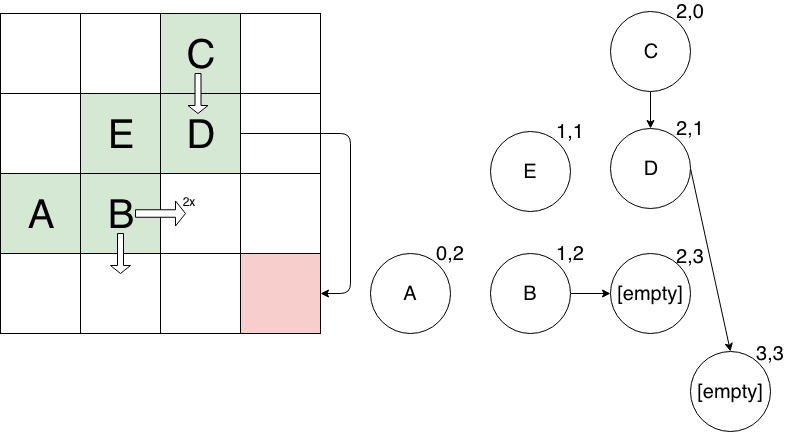

> Note for B, we sum up all RelativeDisplacements to get (2, 1) and then compute and use the Unit Step which is (1, 0.5). Every step is a rounded value. We add the nodes of our anticipated locations to the node graph as well.

Now relax the graph. We notice that we haven't gotten any collisions yet (phew). Continue relaxing the graph since it has changed since the previous iteration:

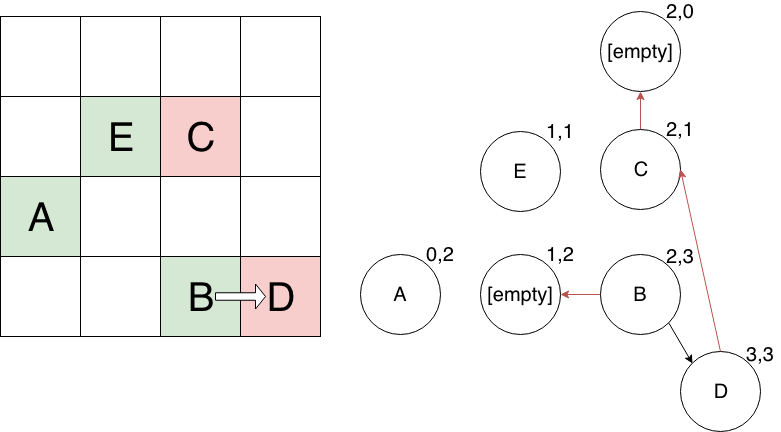

> Note here, we keep track of our previous space(s) for all units that moved, denoted by a red arrow point back to it.

Uh-oh! Notice the collision on (3,3). In order to resolve the collision, we'll use the return edges to move B and D back to their previous positions for our next relax iteration.

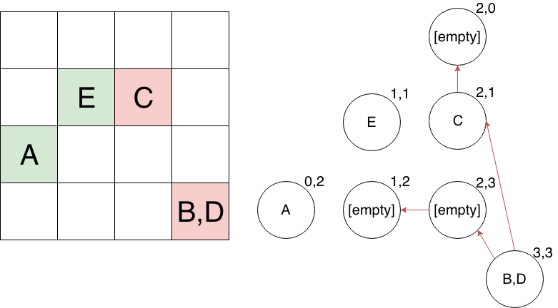

Darn, did we mess up? We still have a collision (2,1). But wait, we'll relax the graph one more time and see what happens.

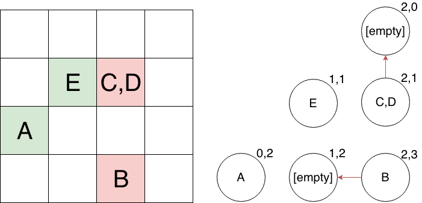

> Here we can remove the node (3,3) because there are no edges pointing to it and there are no units on it either.

Nice! Looks like no collisions exist anymore. Notice that if we relax the graph one more time, the graph will not change. Therefore we've reached our result.

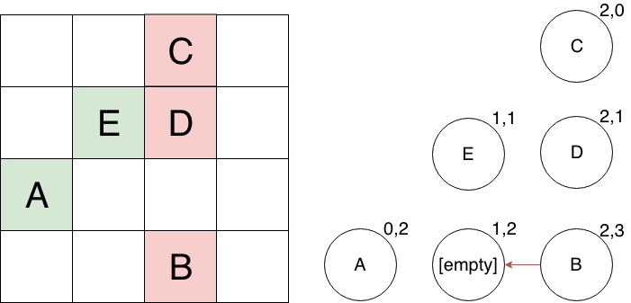

> Remember that we no longer want to move B, C, or D forward anymore because they've all been marked with "collision".

Thus the resultant board is given back to the timeline. The timeline will move all those units accordingly during the phase.

### Code Design

The current timeline implementation does the above by creating a simulation of nodes and units. The simulation only applies the move effects by instantiating a `SimulatedDisplacement` object for each unit. The will perform the algorithm above, updating all the SimulatedDisplacements until the graph has settled. The resultant SimulatedDisplacement hold information about the movement.

```C#
public class SimulatedDisplacement {
	public UnitDisplacement displacement;
	public Vector2 result;
	public Vector2 current;
	public bool conflict;

	public Vector2 GetNextSimulationStep() ...
	public Vector2 GetPreviousSimulationStep() ...
	...
}
```

As a recap, the implementation of the simulation is the alamgamation of the movement aggregation and collision detection agorithm steps ran in order. The execution diagram looks like follows:

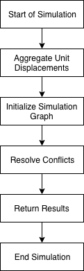

The code which starts off this process is in `Timeline.cs`. 

```C#
private void PlayFrame(List<Player> players, Board board) {
	...

	//Play Execution Based on Order
	foreach(ActionType type in actionOrder) {
		...
		Dictionary<Unit, UnitDisplacement> displacements = GetDisplacements(players, actions, board);
		List<SimulatedDisplacement> result = SimulateDisplacements(displacements, board);

		foreach(SimulatedDisplacement sim in result) {
			//Move and execute units
			...
		}
	}
	...
}
```

`GetDisplacements` return an aggregated list of UnitDisplacements for each unit.
```C#
private Dictionary<Unit, UnitDisplacement> GetDisplacements(List<Player> players, Queue<Unit> units, Board board) {
	//Add all units making actions
	while(units.Count > 0) {
		Command command = ...
		UnitDisplacement displacement = command.frame.GetDisplacement(unit, command.dir, board);

		//Amalgamate displacement
		if(results.ContainsKey(unit))
			//add the displacement to the dictionary
			...
	}

	//Add all units who wait
	foreach(Player player in players) {
		foreach(Unit unit in player.units) {
			//Add all units who don't move as an AbsoluteDisplacement to its current location
			...
		}
	}

	return results;
}
```

`SimulateDisplacements` constructs the node graph and runs the algorithm specified above to deterministically find the resulting locations all units will end on.

```C#
private List<SimulatedDisplacement> SimulateDisplacements(Dictionary<Unit, UnitDisplacement> units, Board board) {
	Dictionary<Vector2, Queue<SimulatedDisplacement>> simulation = new Dictionary<Vector2, Queue<SimulatedDisplacement>>();
	List<SimulatedDisplacement> results = new List<SimulatedDisplacement>();

	//Initialize Simulation
	foreach(KeyValuePair<Unit, UnitDisplacement> pair in units) {
		SimulatedDisplacement sim = new SimulatedDisplacement(pair.Value, pair.Value.GetTargetCoordinate());
		Vector2 next = sim.GetNextSimulationStep();
		//Aggregate common 
		...
		simulation[next].Enqueue(sim);
	}

	//Simulate until relaxed
	simulation = ResolveConflicts(simulation);

	//All simulation entries should only have one unit at this point
	foreach(KeyValuePair<Vector2, Queue<SimulatedDisplacement>> pair in simulation) {
		results.Add(pair.Value.Dequeue());
	}

	return results;
}
```
> The implementation doesn't construct a real graph. The subsitute is using a `Dictionary<Vector2, Queue<SimulatedDisplacement>>`.


